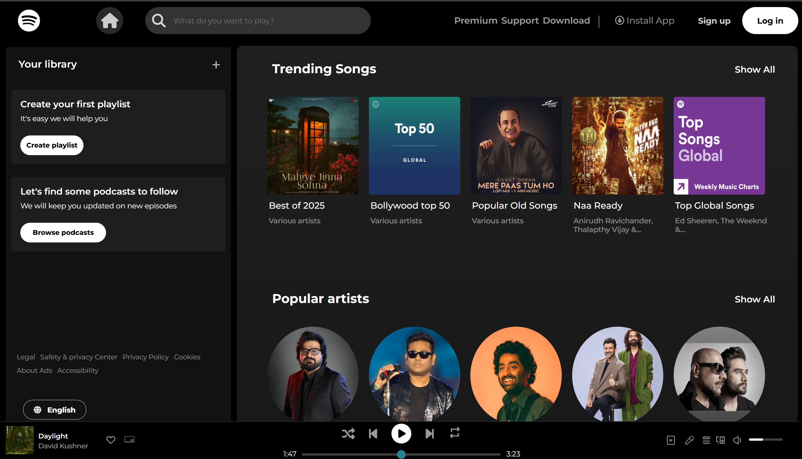

# 🎧 Spotify Web UI Clone (HTML + CSS Only)

> A polished, interactive replica of Spotify’s desktop interface — crafted with clean HTML and modern CSS.  
> Built as a frontend layout practice project with real-world styling details.

---

## 🧩 Project Overview

This is a **static, frontend-only clone** of the Spotify web player UI. The design closely mimics Spotify's desktop layout using just HTML and CSS — no frameworks, no JavaScript.

It includes:
- Interactive hover effects
- Well-structured layout using Flexbox and Grid
- Organized, readable code ideal for practice or portfolios

---

## 🛠️ Technologies Used

| Tool / Language | Purpose                              |
|------------------|---------------------------------------|
| `HTML5`          | Base structure and semantic layout    |
| `CSS3`           | Styling, hover effects, visual detail |
| `Flexbox & Grid` | Interface layout and spacing          |
| `VS Code`        | Development environment               |

---

## 🖼️ UI Preview

<p align="center">
  
</p>

---

## 📁 Project Structure

---

## 📁 File Layout
spotify-clone-css/
├── index.html # Main HTML entry
├── style.css # All styles and layout rules
└── assets/ # Images and icons used in UI
└── preview.png # Optional screenshot for README


---


---

## ✨ Features

- 🎨 Spotify-inspired design and layout
- 🖱️ Hover interactions for icons, buttons, playlists
- 🔳 Structured using CSS Grid and Flexbox
- 🧼 Clean, modular CSS without clutter or frameworks

---

## 📐 Responsiveness

The layout is designed for **desktop resolutions** and may not fully adapt to smaller screens. It includes interactive styling but does not scale fluidly for mobile devices.

---

## How to Use

No installation or server needed — simply open the HTML file in your browser:

```bash
# Clone the repository
git clone https://github.com/your-username/spotify-clone-css.git
cd spotify-clone-css

# Open in your browser (Windows)
start index.html
```

👤 Author

Mohit Singh
NIT Jalandhar • Frontend Learner

    Exploring the web, one clone at a time.
